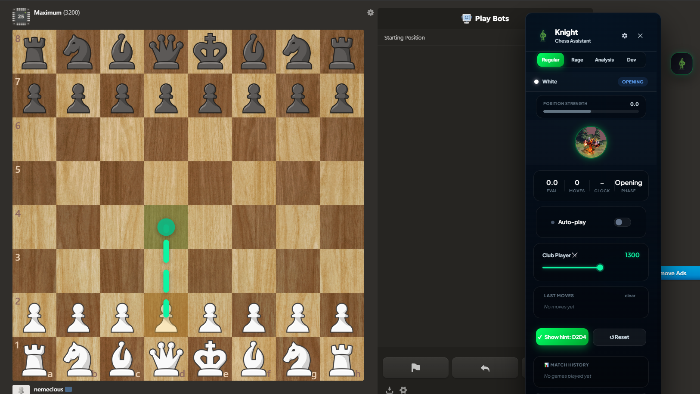
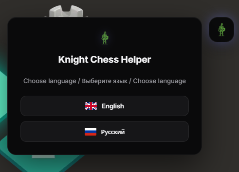

# Knight Chess Helper

A local-first chess analysis assistant for Chess.com, powered by Stockfish WebAssembly.

Local · Open Source · Privacy-First · Manifest V3

  
  
  
  

  
  
  

---

## Table of Contents

- [Overview](#overview)
- [Features](#features)
- [Interface Preview](#interface-preview)
- [Installation](#installation)
- [Documentation](#documentation)
- [Architecture](#architecture)
- [Roadmap](#roadmap)
- [Contributing](#contributing)
- [Responsible Use](#responsible-use)
- [License](#license)

---

## Overview

Knight is a chess assistant built for analysis, study, opening preparation and post-game review directly inside your browser.

It runs a local Stockfish WebAssembly engine — nothing is sent to a remote server, so analysis works offline and your data stays on your machine. The interface is designed with a focus on speed and clarity.

- Local engine — no external API, full privacy
- Real-time evaluation and principal variations
- Redesigned dark and light themes
- Privacy-first — your games never leave your machine

---

## Features

| Feature | Description |
|---|---|
| Stockfish Engine | Local WebAssembly engine — private and offline-capable |
| Position Strength | Live centipawn evaluation bar with a numeric readout |
| Best-Move Hints | Visual arrows drawn on the board for study |
| Opening Book | Opening recognition and preparation suggestions |
| Match Statistics | Offline tracking of moves, phases and game history |
| Multi-Language | English and Russian out of the box |
| Light & Dark Themes | Theme switcher in a dedicated Settings tab |
| Manifest V3 | Modern, service-worker based architecture |

---

## Interface Preview

Click to expand screenshots

 

  

  

---

## Installation

Knight is distributed via GitHub and loaded as an unpacked extension (it is not on the Chrome Web Store).

### Chromium browsers (Chrome, Edge, Brave, Opera)

1. Download the latest [release](https://github.com/physicalaff/Knight-Chess-Helper/releases) `.zip`.
2. Extract it into a dedicated folder.
3. Open `chrome://extensions` in your browser.
4. Enable Developer mode (top-right).
5. Click Load unpacked and select the extracted folder.
6. Open [Chess.com](https://www.chess.com/) and click the floating Knight icon.

A full step-by-step walkthrough with screenshots is available in the [User Guide](docs/USER_GUIDE.md#-installation).

### Firefox (experimental)

Open `about:debugging` → This Firefox → Load Temporary Add-on and pick any file inside the extension folder.

Note: Firefox support is in beta — most features work, but some may behave differently.

---

## Documentation

| Document | Contents |
|---|---|
| [User Guide](docs/USER_GUIDE.md) | Feature tour, interface reference, settings, install walkthrough, troubleshooting |
| [Contributing](CONTRIBUTING.md) | Build instructions, code architecture, and pull request guidelines |

The User Guide includes a clickable table of contents, so every heading is a jump-link.

---

## Architecture

  

Knight is split into focused, single-responsibility modules:

| Layer | Responsibility |
|---|---|
| Content scripts (`ui.js`, `mouse.js`, `book.js`, `stats.js`) | Inject the dashboard, draw on the board, track stats |
| Background service worker (`background.js`) | Coordinate messages and engine requests (Manifest V3) |
| Offscreen document (`offscreen.js`) | Host the Stockfish WebAssembly worker |
| Engine layer (`engine.js`) | Run analysis, manage retries and evaluation parsing |

This keeps analysis responsive while remaining fully compatible with Manifest V3.

---

## Roadmap

- [x] Stockfish WebAssembly integration
- [x] Opening book
- [x] Statistics tracking
- [x] Full UI redesign (light and dark themes)
- [x] Multi-language support
- [ ] Puzzle / tactics trainer
- [ ] Exportable analysis reports
- [ ] Additional languages

---

## Contributing

Contributions are welcome.

- Star the repo to support the project
- Report bugs via [Issues](https://github.com/physicalaff/Knight-Chess-Helper/issues)
- Suggest features you would like to see
- Open a PR — see [CONTRIBUTING.md](CONTRIBUTING.md) for setup and guidelines

---

## Responsible Use

Knight is built for learning, analysis, opening preparation and reviewing your own games.

Please use it responsibly and respect the Terms of Service of any platform where you play. Do not use Knight to gain an unfair advantage in live games against other people.

---

## License

Knight Chess Helper is released under the MIT License.
Stockfish is licensed under the GPLv3.

---

If Knight helps your chess, consider leaving a star.

