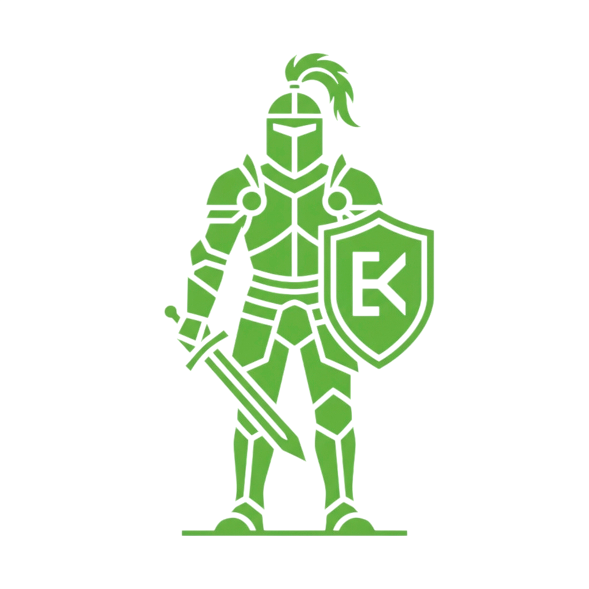

### ⭐ If you like the project — please give it a star!

  

#  Knight — Chess Helper v6.1.0

  
  
  
  
  

---

## 📊 Project Analytics

  

  
  

  
  

  
  
  
  
  

---

## 🚀 Key Features

* 🤖 **Auto-Play** — Automatically execute moves on your behalf with natural, randomized human delay and organic mouse paths.
* 🧠 **100% Local Engine** — Powered by a local **Stockfish WebAssembly** engine. It performs all calculations inside an isolated, secure background process without making third-party server calls, bypassing Chess.com's strict Content Security Policy (CSP).
* 🎲 **Behavioral Human Presets** — Instantly choose from multiple curated play styles (Beginner, Intermediate, Advanced, Aggressive, Positional), or unlock **Custom Controls** to manually adjust blunder rates, mouse speeds, and thinking time variance.
* 🛡️ **Anti-Ban 3.0 Emulations** — Deeply integrated behavioral parameters to evade detection:
  * **Mouse Movement 2.0:** Smooth Bezier curves with micro-tremors (physical hand vibrations).
  * **Mouse Misclicks:** A small percentage chance to click a neighboring square first, pause in hesitation, cancel, and then play the correct move.
  * **Emulated Fatigue:** Thinking times naturally slow down by 2.5% per turn as the game progresses past move 15, mimicking mental fatigue.
  * **Random Distractions:** Randomly takes a long, natural pause of 8-15 seconds to simulate a player stepping away from the screen.
  * **Dynamic Search Depth:** Stockfish search depth randomly fluctuates by $\pm 2$ plies to break constant depth analysis tracking.
  * **Pondering:** Background pre-calculations on your opponent's turn allow for near-instant premoves when the expected line is played.
* 🌌 **ZXC / Shadow Fiend Mode** — Activating this legendary mode overhauls the interface:
  * **Visual Theme:** Entire UI shifts to a dark-matte neon-red design.
  * **Active Avatar:** Replaces panel logos and floating orbs with an animated Shadow Fiend GIF (`assets/sf.gif`).
  * **Audio Sync:** Upon activation, plays the theme track (`assets/sf.mp3`) with active tab visibility auto-play/pause/stop triggers.
* 🔊 **Independent Mute Toggles** — Easily disable victory sounds, setup greeting voices, or the SF background music.
* ⬡ **Instant Board Hints** — Draws the best move dynamically on the chessboard using animated dashes and arrows. **Zero cooldown**—hints update instantly on click.
* 📖 **Opening Book** — Automatically plays the first 14 half-moves naturally using Lichess Masters Database.
* 📊 **Game Statistics** — Saves and tracks your offline winrate and total games played.

---

## 📊 Configuration Matrices

<b>📐 Click to expand Human Behavior Presets Table</b>

### Human Behavior Presets
We designed a mathematically calibrated preset system to perfectly emulate human play styles. Adjust these presets directly in the settings panel:

| Profile | Depth | Blunder % | Mouse Speed | Think Variance | Target Audience |
| :--- | :---: | :---: | :---: | :---: | :--- |
| 👶 **Beginner** | 3 | 12% | 0.7x | 0.8x | Casual/Novice Play |
| 📈 **Intermediate** | 5 | 5% | 1.0x | 1.0x | Standard Club Level |
| 🎓 **Advanced** | 8 | 1.5% | 1.3x | 1.3x | Competitive Matchplay |
| ⚔️ **Aggressive** | 6 | 2% | 1.2x | 0.4x | Fast, tactical and sharp play |
| 🛡️ **Positional** | 6 | 1% | 0.9x | 1.2x | Deep strategic and slow maneuvering |
| ⚙️ **Custom** | *Manual* | *Manual* | *Manual* | *Manual* | Full granular control |

<b>📉 Click to expand ELO Scaling Matrix Table</b>

### ELO Scaling Matrix
The ELO slider dynamically adjusts the following core engine parameters in real-time:

| ELO Level | Category | Depth | Mistake Chance | Blunder Chance | Average Thinking Time | Mouse Wobble |
| :---: | :--- | :---: | :---: | :---: | :---: | :---: |
| **1000** | Beginner | 3 plies | 30% | 8% | ~300ms – 2.0s | Heavy (5px) |
| **1100** | Casual | 4 plies | 25% | 6.5% | ~400ms – 2.4s | Moderate (4.3px) |
| **1200** | Intermediate | 5 plies | 21% | 5.2% | ~450ms – 2.7s | Moderate (3.6px) |
| **1300** | Club Player | 6 plies | 17% | 4% | ~500ms – 3.0s | Light (2.9px) |
| **1400** | Strong Club | 7 plies | 12% | 2.8% | ~550ms – 3.4s | Light (2.2px) |
| **1500** | Advanced | 8 plies | 8% | 1.5% | ~600ms – 3.8s | Smooth (1.5px) |

---

## 🔒 Privacy & Telemetry Disclosure

To help the developer evaluate the active user base and decide whether to continue dedicating time to future updates or archive the project, the extension includes a lightweight, 100% anonymous telemetry system.

* **What is tracked:** A randomly generated unique client ID (e.g., `usr_abcdef123`) and the date/time of the daily extension launch.
* **What is NOT tracked:** Absolutely no personal data, Chess.com credentials, session cookies, tokens, or game histories are collected. 
* **How it works:** Once a day, when you open Chess.com, the extension sends a single anonymous ping to a secure, private Google Spreadsheet.
* **Why this is necessary:** This data is used solely as a signal of active interest. It helps the developer understand if there is a real audience using the assistant, determining whether to release future updates or archive the repository.

---

## 🛠️ Installation Guide

Since the extension runs locally and is not hosted on the Chrome Web Store, you can easily install it as an unpacked developer extension:

1. **Download the source:** Clone this repository or download the latest zipped bundle from the [Releases](https://github.com/physicalaff/Knight-Chess-Helper/releases) page.
2. **Unpack the archive:** Extract the files into a dedicated folder on your computer.
3. **Open Extensions Page:** Navigate to `chrome://extensions/` in Chromium browsers (or `about:debugging` in Firefox).
4. **Enable Developer Mode:** Toggle the **Developer mode** switch in the top-right corner.
5. **Load Unpacked:** Click the **Load unpacked** button (or "Load Temporary Add-on") and select the extracted extension folder.
6. **Start Playing:** Open any game on [Chess.com](https://www.chess.com/) and click the floating Knight icon to open the dashboard!

---
## 🏗️ Architecture & Security

To bypass Chess.com's strict sandboxing and Content Security Policies, Knight uses a modern Manifest V3 multi-layered messaging system:

  

---

## ⚖️ Disclaimer

> [!WARNING]
> This software is developed strictly for **educational and research purposes**. Using chess assistants, bots, or engines to cheat in online rated matches is a violation of Chess.com's Terms of Service and will result in account suspension. The author of this extension is not responsible for any misuse, account bans, or competitive violations. Use responsibly!

---

## 📝 License

This project is licensed under the MIT License - see the [LICENSE](LICENSE) file for details. Stockfish is licensed under the GPLv3.
