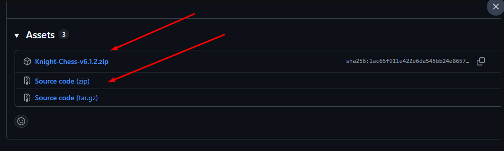
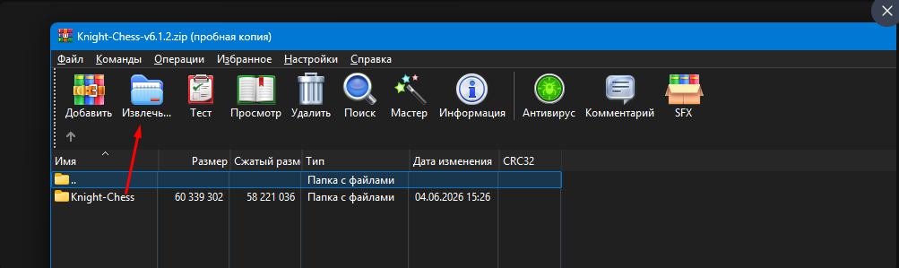
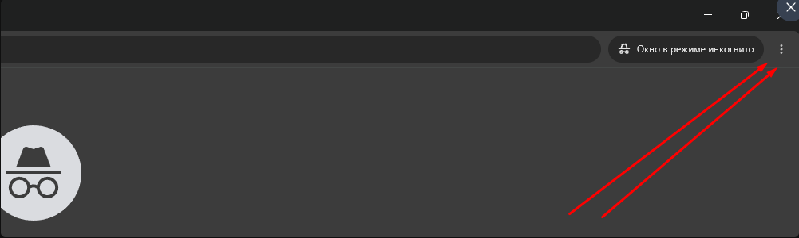
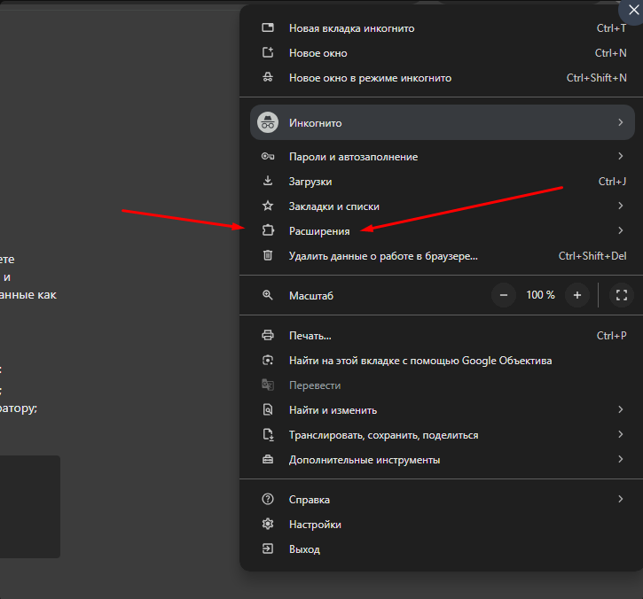
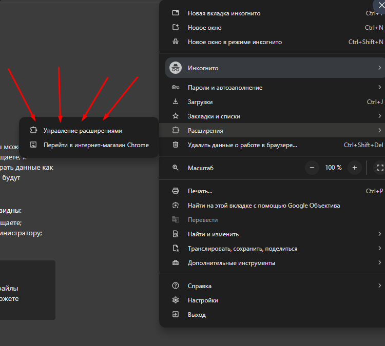
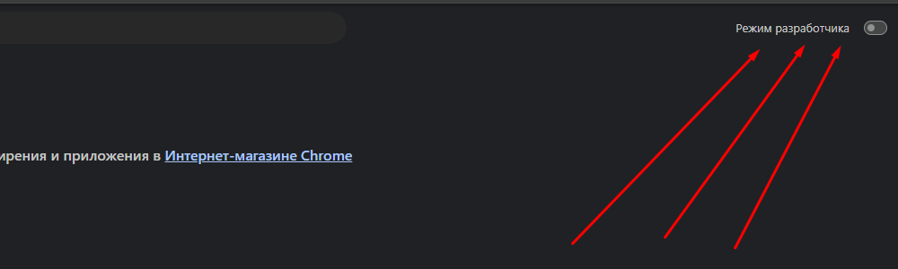
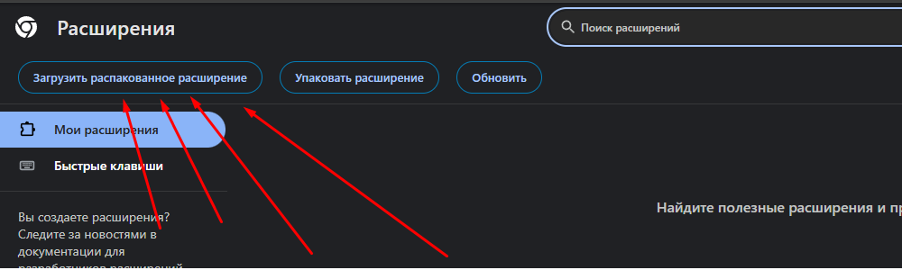
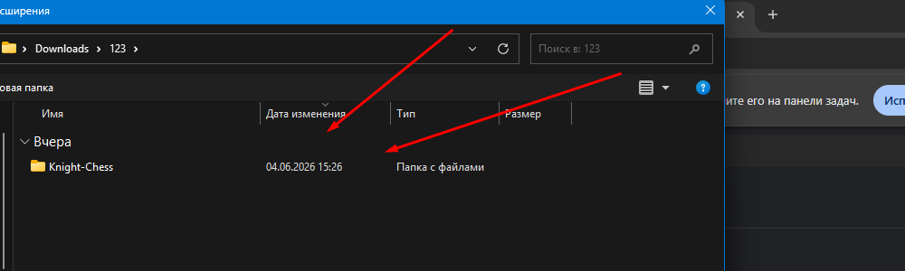
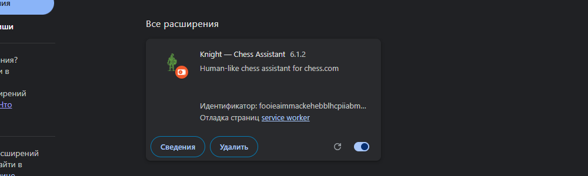

#  Knight — Chess Assistant User Guide

Welcome to the official user guide for **Knight — Chess Assistant**. This guide provides a concise overview of the assistant's features, emulated human behaviors, customization options, and step-by-step installation instructions.

---

## 🚀 Key Features

### 📊 Dashboard & UI
* **Floating Glassmorphic Panel:** A draggable dashboard injected directly into Chess.com.
* **Real-time Evaluation Bar:** Visual centipawn bar showing the current position evaluation (green for advantage, red for disadvantage).
* **Live Statistics:** Displays Stockfish evaluation, total moves, active game phase (Opening, Middlegame, Endgame), and current game clock.

### ⚙️ Human Playstyle Presets
You can select a predefined preset or customize your own settings:
* **Beginner:** Depth 3 | 12% Blunder Rate | 0.7x Mouse Speed | 0.8x Think Variance
* **Intermediate:** Depth 5 | 5% Blunder Rate | 1.0x Mouse Speed | 1.0x Think Variance
* **Advanced:** Depth 8 | 1.5% Blunder Rate | 1.3x Mouse Speed | 1.3x Think Variance
* **Aggressive:** Depth 6 | 2% Blunder Rate | 1.2x Mouse Speed | 0.4x Think Variance (fast, sharp tactical play)
* **Positional:** Depth 6 | 1% Blunder Rate | 0.9x Mouse Speed | 1.2x Think Variance (slow, solid strategic maneuvering)
* **Custom:** Unlocks sliders for blunder rate, mouse speed, and thinking variance.

### 🛡️ Anti-Ban 3.0 Emulations
To emulate human play and bypass bot detection:
1. **Bezier Mouse Paths:** Moves the cursor using natural curves, micro-tremors, and acceleration.
2. **Cognitive Fatigue:** past move 15, adding a 2.5% cumulative delay per turn to think times.
3. **Random Distractions:** A small chance past move 6 to pause for 8–15 seconds, simulating a distraction.
4. **Dynamic Depth:** Stockfish search depth randomly fluctuates by $\pm 2$ plies on every move.
5. **Simulated Misclicks:** Occasionally targets a neighboring square, hesitates, cancels, and makes the correct move.
6. **Pondering:** Calculates opponent moves in the background to play instant premoves.

### 🌌 Shadow Fiend (ZXC) Mode
* **Dark Matte Theme:** Switches the UI to a premium neon-red/matte-black design.
* **SF Avatar:** Replaces dashboard icons with an animated Shadow Fiend GIF.
* **Theme Music:** Plays the SF audio track, automatically pausing when switching tabs and stopping when the tab is closed.

---

## 🛠️ Step-by-Step Installation Guide

Since the extension runs locally and is not hosted on the Chrome Web Store, it must be loaded as an unpacked extension.

### Step 1: Download the Release
Go to the repository's [Releases](https://github.com/physicalaff/Knight-Chess-Helper/releases) page. Under the **Assets** section of the latest release, download the `Knight-Chess-vX.X.X.zip` package.

---

### Step 2: Extract the ZIP Archive
Extract the ZIP file into a dedicated folder on your computer (e.g., `Knight-Chess`).

---

### Step 3: Open Chrome Menu
Open Google Chrome. Click the **3 vertical dots** menu icon in the top-right corner of the window.

---

### Step 4: Go to Extensions
In the dropdown menu, hover over **Extensions** (Расширения) to open the submenu.

---

### Step 5: Click Manage Extensions
Click on **Manage Extensions** (Управление расширениями) to open the extensions configuration tab (`chrome://extensions/`).

---

### Step 6: Enable Developer Mode
In the top-right corner of the Extensions page, toggle the **Developer mode** (Режим разработчика) switch to **ON**.

---

### Step 7: Click Load Unpacked
Click the **Load unpacked** (Загрузить распакованное расширение) button in the top-left corner.

---

### Step 8: Select the Extracted Folder
In the file selection dialog, select the **Knight-Chess** folder you extracted in Step 2.

---

### Step 9: Verify Active Status
The **Knight — Chess Assistant** card should appear. Ensure the toggle switch is turned **ON**.

You're ready! Open [Chess.com](https://www.chess.com/) and click the floating Knight icon to open the dashboard.

---

## ❓ Troubleshooting

> [!IMPORTANT]
> **Issue: The Choose Language screen is unresponsive.**
> * *Fix:* Update to version **v6.1.2** or higher. This issue has been fully resolved.
>
> **Issue: The panel is cut off at the bottom of the screen.**
> * *Fix:* Scroll inside the panel to access elements near the bottom. Adaptive scrolling is enabled.
>
> **Issue: Clock shows incorrect time.**
> * *Fix:* Make sure you are playing a live game. The clock auto-aligns with the bottom player viewport. Toggle the panel off and on to reset.
